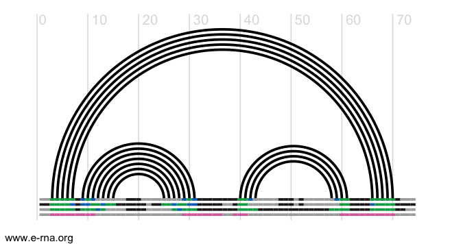

EvoClustRNA
================================================================================
Marcin Magnus & Rhiju Das

     
A clustering routines of evolutionary conserved regions (helical regions) for RNA fold prediction. 

At the moment we are testing the approach using models from ROSETTA/FARNA (https://www.rosettacommons.org/) and SimRNAweb (http://genesilico.pl/SimRNAweb/).

The documentation can be found here http://evoclustrna.readthedocs.io/en/latest/
	
# Example

## RNA Puzzle Challenge 14: L-glutamine riboswitch (#1 modeling in the ranking)

(bound sequence)

Figure.  An arc diagrams of RNA secondary structures of used homologous sequences (3 sequences). The last line (in pink) markes conserved segments common for all three sequences. These segments are taken for clustering.

	python evoClustRNA.py
	 --rna_alignment_fn test_data/rp14sub.stk 
	 --output_dir test_out/rp14 
	 --input_dir test_data/rp14/
	 --mapping 'target:rp14_farna_eloop_nol2fixed_cst|AACY023581040:aacy23_cst|AJ630128:aj63_cst' 
	 -x test_out/rp14/rp14_matrix.txt

Read more about the method <http://evoclustrna.readthedocs.io/en/latest/getstarted.html>.

The results <http://ahsoka.u-strasbg.fr/rnapuzzles/Problem0014_Bound/14_index.php>
