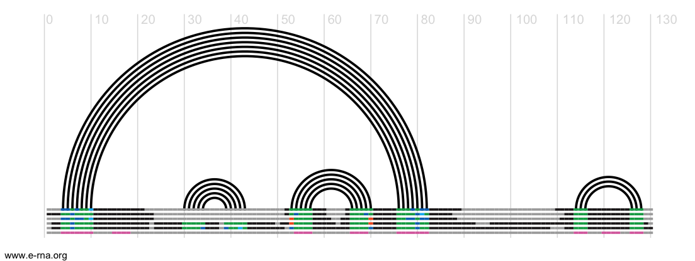

EvoClustRNA
================================================================================

A clustering routines of evolutionary conserved regions (helical regions) for RNA fold prediction.

At the moment we are testing the approach using models from Rosetta Farna (https://www.rosettacommons.org/) and SimRNAweb (http://genesilico.pl/SimRNAweb/).

# THE PAPER IS OUT

Magnus M, Kappel K, Das R, Bujnicki JM. RNA 3D structure prediction guided by independent folding of homologous sequences. BMC Bioinformatics; 2019;:1–15. 
https://bmcbioinformatics.biomedcentral.com/articles/10.1186/s12859-019-3120-y

# Installation
To install the package, type:

    git clone https://github.com/mmagnus/EvoClustRNA.git

or download https://github.com/mmagnus/EvoClustRNA/archive/master.zip and unzip the file.

To install, type:

    pip install --user -r docs/requirements.txt

# Documentation

See the documentaiton <http://EvoClustRNA.rtfd.io>

# Example

See the RNA-Puzzle 13 example: <https://github.com/mmagnus/EvoClustRNA/tree/master/test_data/rp13>
